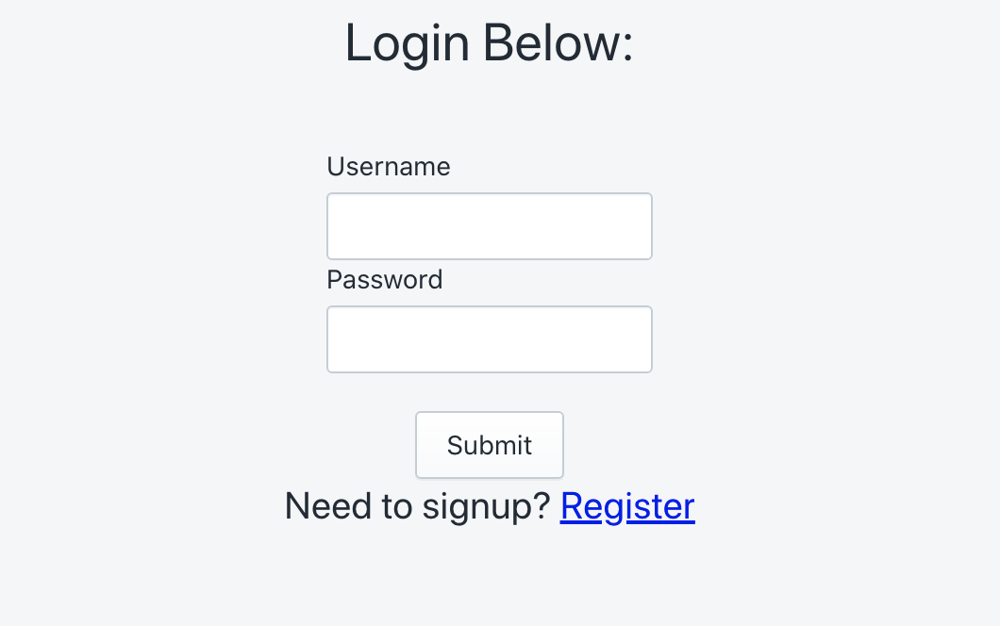
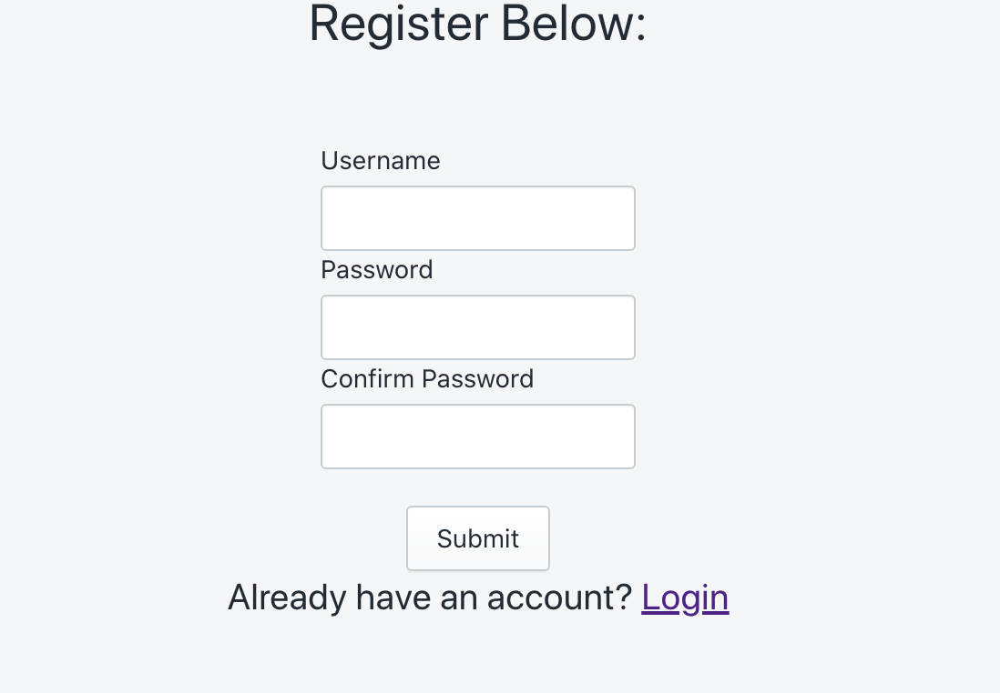
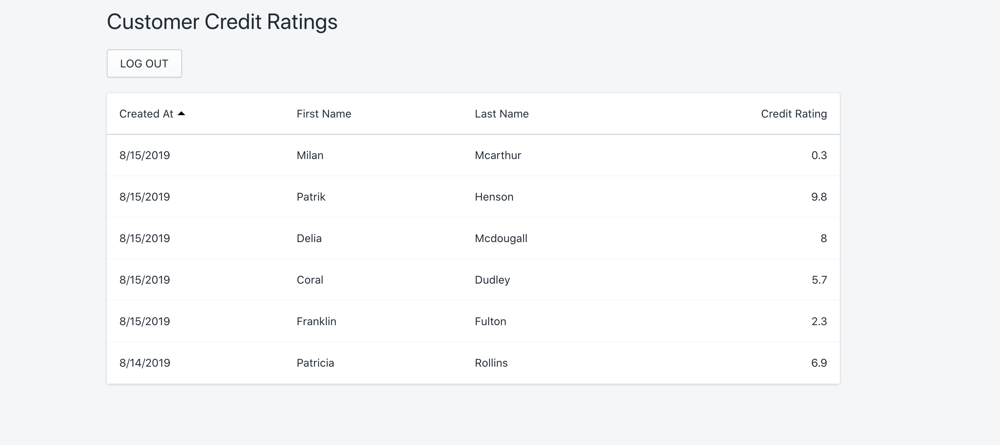

# API Assessment

**access here**: http://34.73.167.211/

## Description
This repo was created as a response to a programming challenge presented to me by a company during the application process. The goals of this project is to consume the output of an API endpoint and display it in the form of a sortable list, using React. As a bonus I was required to create a fake login/registration flow.

### Technologies
- Node.js
- Express.js
- React.js
- React Hooks
- Typescript
- Next.js
- Docker
- Google Cloud (GCP)
- Kubernettes
- Shopify Polaris CSS Framework

### Reasoning

I chose to go with the Next.js framework in order to demonstrate how Server Side Rendering(SSR) can be used to fetch the required api data. I used Docker to create an image I could deploy to my K8's cluster on GCP.

I used Shopify Polaris CSS framework because from experience I knew it had the exact components I need to quickly put together the front-end. While looking somewhat pleasing. (Who needs product designers anyway...)

The authentication flow is very simple. Once a user registers, it saves their username and encrypted password in cookies, and automatically logs them into the dashboard. (A database would have been overkill for this project). You can logout from the dashboard and then try and login with the same credentials. However, if you do clear your cookies, you will need to once again register.

### Screenshots

Login:

Registration:

Account:
